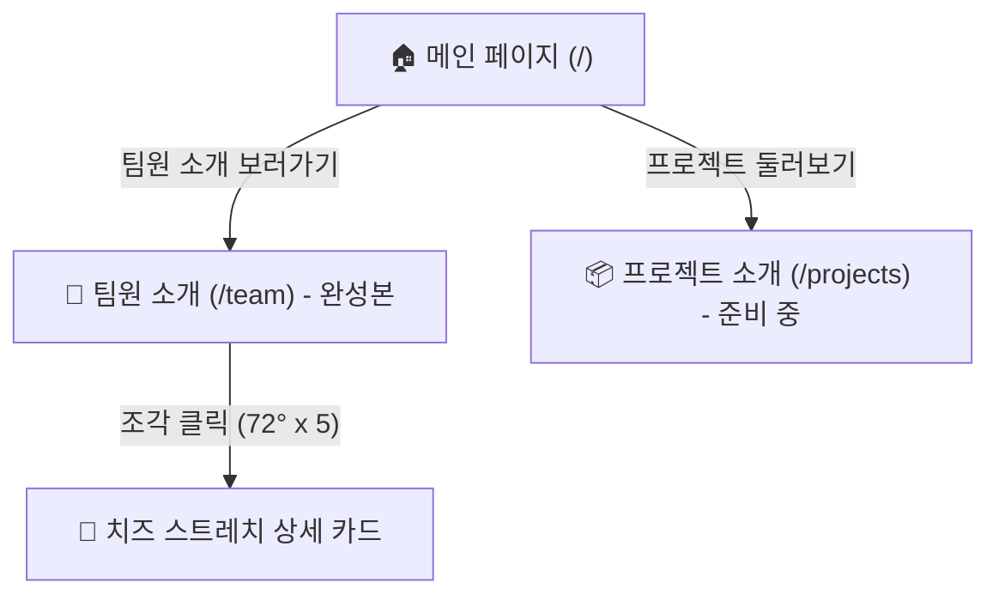

# 🍕 피자스타트업 (Pizza Startup) 웹사이트 인수인계서 (HANDOFF)

본 문서는 **피자스타트업 팀 소개 웹사이트**의 기획, 기술 스택, 디자인 시스템, 프로젝트 구조, 배포 파이프라인 및 유지보수 가이드를 정리한 인수인계 문서입니다.

---

## 1. 프로젝트 개요 및 주요 링크

- **프로젝트명**: 피자스타트업 팀 소개 웹사이트
- **목적**: 5인(남궁지영, 민아현, 윤서현, 이주현, 임다희)의 고유한 토핑과 개성을 피자 한 판의 조화로 표현하는 인터랙티브 웹사이트
- **🌐 GitHub Pages 라이브 사이트**: [https://zhiying163-alt.github.io/pizza-startup/](https://zhiying163-alt.github.io/pizza-startup/)
  - 팀원 소개 직통: [https://zhiying163-alt.github.io/pizza-startup/team/](https://zhiying163-alt.github.io/pizza-startup/team/)
  - 프로젝트 소개 직통: [https://zhiying163-alt.github.io/pizza-startup/projects/](https://zhiying163-alt.github.io/pizza-startup/projects/)
- **🐙 GitHub 원격 저장소**: [https://github.com/zhiying163-alt/pizza-startup](https://github.com/zhiying163-alt/pizza-startup)

---

## 2. 기술 스택 (Tech Stack)

| 분류 | 기술 / 라이브러리 | 용도 및 버전 |
| :--- | :--- | :--- |
| **Framework** | Next.js 16 (Turbopack, App Router) | 정적 웹 애플리케이션 프레임워크 (`output: 'export'`) |
| **Language** | TypeScript 5, React 19 | 정적 타입 안정성 및 모던 컴포넌트 아키텍처 |
| **Styling** | Tailwind CSS v4 | 유틸리티 퍼스트 스타일링 & 커스텀 키프레임 애니메이션 |
| **Typography** | Google Fonts (`Jua`, `Gowun Dodum`) | 제목: 둥글고 귀여운 `Jua` / 본문: 부드러운 `Gowun Dodum` |
| **Icons & Visuals**| Pure SVG Topping Icons, Lucide Icons | 이모지 없이 직접 구현한 수제 토핑 벡터 그래픽 및 UI 아이콘 |
| **Interactions** | Canvas Confetti, Pure CSS & SVG Matrix | 피자 분리 모션, 치즈 스트레치 바운스, 토핑 유영 효과 |
| **CI / CD** | GitHub Actions (`deploy.yml`) | `main` 브랜치 푸시 시 자동 빌드 및 GitHub Pages 배포 |

---

## 3. 디자인 시스템 & 무드보드

### ① 컬러 시스템 (자연스러운 베이킹 팔레트)
* **도우 베이지 (Background)**: `#FBF6EE` (따뜻하고 편안한 단색 배경)
* **크러스트 브라운 (Border / Text)**: `#4A3525`, `#2B1E16` (손그림 느낌의 굵은 테두리와 본문 텍스트)
* **토마토 레드 (Primary Accent)**: `#D9383A` (CTA 버튼, 메인 포인트)
* **치즈 옐로 (Secondary Accent)**: `#F5A623` (보조 버튼, 하이라이트 배지)

### ② 5인 시그니처 토핑 & 상징 컬러 매핑
인위적인 AI 네온 컬러를 배제하고 자연스러운 원재료의 색감을 채택했습니다:

| 번호 | 이름 | 상징 토핑 | 고유 컬러 코드 | 토핑 SVG 아이콘 |
| :---: | :---: | :---: | :---: | :---: |
| **1** | **남궁지영** | 토마토 (Tomato Red) | `#D9383A` | [`TomatoTopping`](src/components/ToppingIcons.tsx) |
| **2** | **민아현** | 치즈 (Cheese Yellow) | `#F5A623` | [`CheeseTopping`](src/components/ToppingIcons.tsx) |
| **3** | **윤서현** | 바질 (Basil Green) | `#386641` | [`BasilTopping`](src/components/ToppingIcons.tsx) |
| **4** | **이주현** | 올리브 (Olive Charcoal) | `#353B29` | [`OliveTopping`](src/components/ToppingIcons.tsx) |
| **5** | **임다희** | 페퍼로니 (Pepperoni Orange) | `#C84B19` | [`PepperoniTopping`](src/components/ToppingIcons.tsx) |

### ③ 핸드메이드 감성 (AI 느낌 배제) 디테일
1. **은은한 종이 질감**: `body::before`에 SVG 프랙탈 노이즈 필터를 삽입하여 수제 종이 텍스처 연출
2. **스티커 틸트(Tilt)**: 카드와 버튼, 탭이 기계적으로 반듯하지 않도록 `-2.5도 ~ +2.2도`의 미세한 불규칙 회전 적용
3. **손그림 테두리**: 둥근 모서리(`rounded-[26px] ~ rounded-[36px]`)와 굵은 외곽선(`border-2`, `border-3`, `border-dashed`)
4. **이모지 0%**: 모든 장식과 배지에 시스템 이모지를 쓰지 않고 수제 SVG 그래픽 사용
5. **절제된 그라데이션**: 메인 상단 헤더 배경과 타이틀 텍스트, 버튼에만 포인트로 사용

---

## 4. 페이지 구성 및 핵심 기능



### 1) 메인 페이지 (`/`) — [`src/app/page.tsx`](src/app/page.tsx)
- **상단 그라데이션 히어로**: 토마토 레드에서 치즈 옐로로 이어지는 따뜻한 오븐 햇살 배경
- **360° 피자 쇼케이스**: 첫 진입 시 피자가 한 바퀴 회전(`animate-pizza-spin-in`)하며 등장
- **핵심 CTA 버튼**: 말랑한 터치감(`.btn-squish`)의 팀원 소개 및 프로젝트 둘러보기 버튼
- **수제 스티커 카드**: 5인의 시그니처 토핑과 원형 색 블록 프로필 미리보기

### 2) 팀원 소개 페이지 (`/team`) — [`src/app/team/page.tsx`](src/app/team/page.tsx)
- **완성본 구현**: 5등분(각 72도) SVG 인터랙티브 피자
- **호버 인터랙션**: 마우스 오버 시 조각이 바깥쪽으로 슬라이드되며 확대(`scale 1.05`)
- **클릭 인터랙션**:
  - 조각 선택 시 피자 컬러의 수제 콘페티 폭죽 효과 발동
  - 우측 상세 카드가 **치즈가 쭈욱 늘어나듯 탄성 있는 모션(`animate-cheese-stretch`)**과 함께 오픈
- **원형 색 블록 프로필**: 임시 프로필 사진 대용 원형 색 블록 (추후 사진 교체 용이 구조)
- **하단 5인 전원 그리드**: 피자 조각을 직접 누르지 않아도 한눈에 팀원 전체를 볼 수 있는 스티커 목록 제공

### 3) 프로젝트 소개 페이지 (`/projects`) — [`src/app/projects/page.tsx`](src/app/projects/page.tsx)
- **'준비 중(Coming Soon)' 임시 페이지**:
  - 350°C 피자 오븐에서 김이 모락모락 피어오르는 수제 애니메이션
  - 베이킹 진행률 게이지 (78%)
  - 홈으로 돌아가기 및 팀원 소개 바로가기 버튼

---

## 5. 프로젝트 디렉토리 구조

```
dsd2-1/
├── .github/
│   └── workflows/
│       └── deploy.yml          # GitHub Actions GitHub Pages 배포 파이프라인
├── public/
│   └── .nojekyll               # GitHub Pages _next 폴더 서빙 지원 파일
├── src/
│   ├── app/
│   │   ├── globals.css         # 폰트, 종이 질감, 키프레임, .btn-squish 정의
│   │   ├── layout.tsx          # Google Fonts CDN, 배경 플로팅 토핑, 헤더/푸터
│   │   ├── page.tsx            # 메인 페이지
│   │   ├── projects/
│   │   │   └── page.tsx        # 프로젝트 소개 (준비 중) 페이지
│   │   └── team/
│   │       └── page.tsx        # 팀원 소개 완성본 페이지
│   ├── components/
│   │   ├── FloatingToppings.tsx # 배경에서 천천히 떠다니는 수제 토핑들
│   │   ├── Footer.tsx          # 공통 수제 푸터
│   │   ├── Header.tsx          # 상단 로고 및 스티커 탭 네비게이션
│   │   ├── InteractivePizza.tsx# 5조각 72° 인터랙티브 SVG 피자
│   │   ├── MemberAvatar.tsx    # 원형 색 블록 & 사진 교체 지원 아바타
│   │   ├── MemberDetailCard.tsx# 치즈 스트레치 팀원 상세 정보 카드
│   │   └── ToppingIcons.tsx    # 순수 SVG 토핑 아이콘 모음 (이모지 대체)
│   └── data/
│       └── team.ts             # 5인 팀원 데이터 원본 (이름, 역할, 소개, 색상 등)
├── next.config.ts              # output: 'export', basePath 자동 매핑
├── package.json
├── tsconfig.json
└── HANDOFF.md                  # 본 인수인계 문서
```

---

## 6. 유지보수 및 운영 가이드 (Maintenance Guide)

### ① 팀원 실제 프로필 사진으로 교체하기
1. 사진 파일을 `public/avatars/` 폴더에 넣습니다 (예: `public/avatars/namgung.png`).
2. [`src/data/team.ts`](src/data/team.ts) 파일을 열고 해당 멤버의 `avatarUrl`에 경로를 입력합니다:
   ```typescript
   {
     id: "namgung",
     name: "남궁지영",
     avatarUrl: "/avatars/namgung.png", // <- 여기에 경로를 적어주면 자동으로 사진 표시!
     // ...
   }
   ```
3. `avatarUrl`이 비어 있으면 기존의 고유 원형 색 블록이 자동으로 노출됩니다.

### ② 역할(Role) 및 한 줄 소개(Bio) 문구 수정하기
[`src/data/team.ts`](src/data/team.ts)에서 자리 표시 문구로 되어 있는 `role`과 `bio`를 실제 문구로 수정하면 웹사이트 전반에 즉시 반영됩니다.

### ③ 로컬 개발 환경 실행
```bash
# 로컬 개발 서버 시작 (http://localhost:3000)
npm run dev

# 프로덕션 빌드 및 정적 익스포트 테스트
npm run build
```

### ④ 배포 방법 (CI/CD)
저장소의 `main` 브랜치에 커밋 후 푸시하면 GitHub Actions가 자동으로 빌드하여 약 40초 내외로 라이브 사이트를 갱신합니다.
```bash
git add .
git commit -m "update: 팀원 정보 갱신"
git push origin dsd2-1:main
```

---

## 7. 주요 구현 히스토리 (Changelog)

- **v1.0.0**: 
  - 사용자 요구사항 수집 인터뷰 진행 및 로드맵 수립
  - Next.js 16 + Tailwind CSS 프로젝트 환경 셋업
  - 메인, 팀원 소개(5조각 인터랙티브 피자), 프로젝트(오븐 준비중) 페이지 1차 런칭
  - GitHub public 저장소 생성 및 GitHub Pages 자동 배포 연동
- **v1.1.0 (디자인 대개편)**:
  - Google Fonts `Jua`(제목) 및 `Gowun Dodum`(본문) 적용
  - 시스템 이모지 전면 배제 및 100% 수제 SVG 토핑 아이콘 도입
  - 배경 종이 질감(Paper grain) 및 배경 유영 토핑 애니메이션 추가
  - 첫 화면 피자 360° 회전 등장 모션 구현
  - 피자 조각 호버 팝아웃 확대 및 클릭 시 치즈 스트레치 카드 오픈 효과 구현
  - 스티커 틸트(-2도~2.5도) 및 말랑한 버튼(`.btn-squish`) 터치 인터랙션 적용
  - 상단 토마토-치즈 오븐 햇살 그라데이션 포인트 적용 및 AI 네온 컬러 배제

---

> [!TIP]
> 추가적인 문의사항이나 새로운 기능 확장(예: 프로젝트 페이지 정식 오픈, 방명록 추가 등)이 필요할 경우 본 인수인계서의 구조를 바탕으로 컴포넌트를 확장하시면 됩니다.
